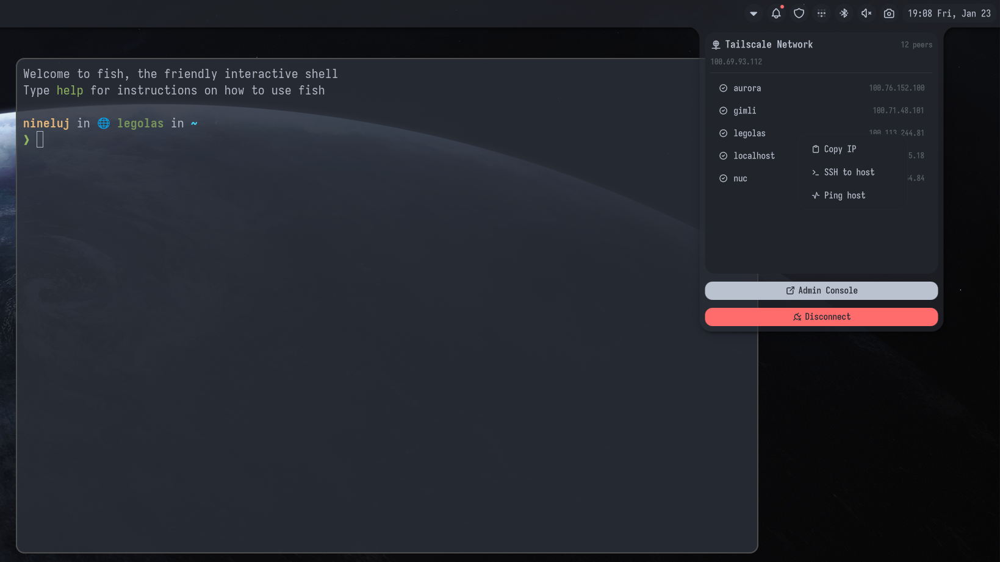

# Tailscale Plugin

A Tailscale status plugin for Noctalia that shows your Tailscale connection status in the menu bar and lets you send and receive files via Taildrop.



> **Disclaimer:** This is a community-created plugin built on top of the great Tailscale CLI tool. It is not affiliated with, endorsed by, or officially connected to Tailscale Inc.

## Features

- **Status Indicator**: Shows whether Tailscale is connected or disconnected with a visual indicator
- **IP Address Display**: Shows your current Tailscale IP address when connected
- **Peer Count**: Displays the number of connected devices in your tailnet
- **Quick Toggle**: Click to connect/disconnect Tailscale
- **Peer Context Menu**: Right-click a peer in the panel to copy its IP or FQDN, launch SSH/ping actions, use it as an exit node, or send a file via Taildrop
- **Node Search**: Optionally filter the panel node list by hostname, DNS name, Tailscale name, IP address, or OS
- **Taildrop Receive**: Toggle file receiving from the panel
- **Exit Node Management**: Activate/deactivate exit nodes from the panel
- **Account Switching**: When multiple Tailscale accounts are logged in locally, a dropdown appears in the panel to switch between them via `tailscale switch`
- **Context Menu**: Right-click for additional options (connect, disconnect, refresh, settings)
- **Configurable Refresh**: Customize how often the plugin checks Tailscale status
- **Compact Mode**: Option to show only the icon for a minimal display

## Requirements

- Tailscale must be installed on your system
- Tailscale must be set up and authenticated

## Taildrop

Taildrop lets you send and receive files between your Tailscale nodes directly from the panel.

### Receiving files

`tailscale file get` normally requires root. The plugin offers two modes, configurable in settings, and a master toggle to disable Taildrop entirely:

| Mode | Setting value | How it works |
|---|---|---|
| **Operator (recommended)** | `operator` | Runs `tailscale file get` as your own user — no prompt. Requires a one-time setup (see below). |
| **pkexec** | `pkexec` | Runs `tailscale file get` via `pkexec` — shows a polkit prompt each time. No setup needed. |

When a receive completes the notification lists each file that appeared in the download directory.

To hide both the Receive button and the Send File option entirely, disable Taildrop in plugin settings.

#### One-time operator setup

Run this once to grant your user operator rights:

```bash
sudo tailscale set --operator=$USER
```

After that, `tailscale file get` works without root and the plugin can receive files without any prompt.

### Sending files

Right-click any online peer in the panel and choose **Send File**. A file picker will open; select one or more files and they will be sent via `tailscale file cp`.

## Settings

| Setting | Default | Description |
|---|---|---|
| `refreshInterval` | `5000` ms | How often to check Tailscale status (1000–60000 ms) |
| `compactMode` | `false` | Show only the icon in the menu bar |
| `showIpAddress` | `true` | Display your Tailscale IP address |
| `showPeerCount` | `true` | Display the number of connected peers |
| `hideDisconnected` | `false` | Hide disconnected peers from the panel list |
| `hideMullvadExitNodes` | `true` | Hide Mullvad VPN exit nodes from the peer list |
| `showSearchBar` | `false` | Show a search field above the panel node list |
| `terminalCommand` | `""` | Terminal for SSH/ping (e.g. `ghostty`, `alacritty`) |
| `sshUsername` | `""` | Username for SSH connections (leave empty for system default) |
| `pingCount` | `5` | Number of pings to send when pinging a peer |
| `defaultPeerAction` | `"copy-ip"` | Action when clicking a peer: `copy-ip`, `ssh`, or `ping` |
| `taildropEnabled` | `true` | Enable Taildrop send/receive. When false, hides the Receive button and Send File option. |
| `taildropDownloadDir` | `"~/Downloads"` | Directory where received files are saved |
| `taildropReceiveMode` | `"operator"` | Taildrop receive mode: `operator` or `pkexec` |
| `loginServer` | `""` | Custom login server URL (e.g. Headscale). Leave empty for default Tailscale. |

## IPC Commands

You can control the Tailscale plugin via the command line using the Noctalia IPC interface.

### General Usage
```bash
qs -c noctalia-shell ipc call plugin:tailscale <command>
```

### Available Commands

| Command | Description | Example |
|---|---|---|
| `toggle` | Toggle Tailscale connection (connect/disconnect) | `qs -c noctalia-shell ipc call plugin:tailscale toggle` |
| `togglePanel` | Toggle Tailscale panel | `qs -c noctalia-shell ipc call plugin:tailscale togglePanel` |
| `status` | Get current Tailscale status | `qs -c noctalia-shell ipc call plugin:tailscale status` |
| `refresh` | Force refresh Tailscale status | `qs -c noctalia-shell ipc call plugin:tailscale refresh` |
| `login` | Trigger Tailscale login (opens browser) | `qs -c noctalia-shell ipc call plugin:tailscale login` |
| `switchAccount` | Switch to a Tailscale account by id (see `tailscale switch --list`) | `qs -c noctalia-shell ipc call plugin:tailscale switchAccount a585` |
| `receive` | Fetch any pending Taildrop files | `qs -c noctalia-shell ipc call plugin:tailscale receive` |

## Usage

1. **Click** the icon to open the Tailscale panel
2. **Right-click the bar widget** to open the context menu (connect/disconnect, settings)
3. **Right-click a peer** in the panel to copy its IP/FQDN, SSH, ping, set as exit node, or send a file
4. **Search nodes**: if enabled in settings, type in the panel search box to filter by hostname, DNS name, Tailscale name, IP address, or OS
5. **Receive via Taildrop**: click "Receive via Taildrop" in the panel to fetch any pending incoming files

## Troubleshooting

### "Not installed" message
If you see "Tailscale not installed" in the context menu, make sure Tailscale is installed and accessible in your PATH.

### Status not updating
If the status doesn't update automatically, try:
1. Increasing the refresh interval in settings
2. Using the "Refresh" option from the context menu
3. Checking that Tailscale is running properly on your system

### Cannot connect/disconnect
Ensure that:
- You have proper permissions to control Tailscale
- Tailscale is authenticated and set up
- No other process is interfering with Tailscale

### Taildrop receive fails
- **Operator mode**: make sure you have run `sudo tailscale set --operator=$USER` first
- **pkexec mode**: ensure `pkexec` is installed and a polkit agent is running
- Check that the download directory exists and is writable

